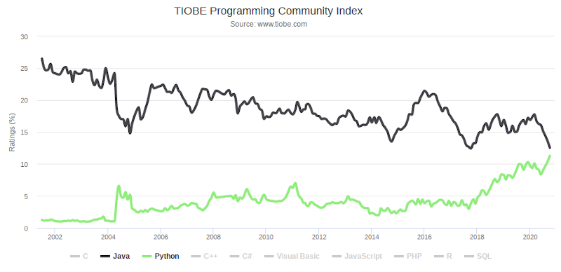

# Python overview

---

# Обо мне

- Работаю backend разработчиком на Python

---

# Обо мне

- Работаю backend разработчиком на Python
- Использую Python с 2010 года

---

# Обо мне

- Работаю backend разработчиком на Python
- Использую Python с 2010 года
- Полностью перешёл на Python в 2015

---

# История

---

# История

- Зачем нужен новый язык?

---

# История

- Создавался как замена shell-подобного языка с богатой стандартной библиотекой

---

# История

- Создавался как замена shell-подобного языка с богатой стандартной библиотекой
- Как велась/ведётся разработка?

---

# История

- Создавался как замена shell-подобного языка с богатой стандартной библиотекой
- Изначально один человек (Гвидо ван Россум), с какого-то момента сообщество core разработчиков

---

# История

- Создавался как замена shell-подобного языка с богатой стандартной библиотекой
- Изначально один человек (Гвидо ван Россум), с какого-то момента сообщество core разработчиков
- Исторические вехи развития языка и сообщества

---

# История

- Февраль 1991: публикация версии 0.9.0

---

# История

- Февраль 1991: публикация версии 0.9.0
- Декабрь 2005: Гвидо ван Россум принят в Google

---

# История

- Февраль 1991: публикация версии 0.9.0
- Декабрь 2005: Гвидо ван Россум принят в Google
- Декабрь 2008: релиз версии 3.0

---

# История

- Февраль 1991: публикация версии 0.9.0
- Декабрь 2005: Гвидо ван Россум принят в Google
- Декабрь 2008: релиз версии 3.0
- Июль 2010: релиз версии 2.7

---

# История

- Февраль 1991: публикация версии 0.9.0
- Декабрь 2005: Гвидо ван Россум принят в Google
- Декабрь 2008: релиз версии 3.0
- Июль 2010: релиз версии 2.7
- Сентябрь 2012: релиз 3.3 (кооперативная многозадачность aka асинхронное программирование)

---

# История

- Февраль 1991: публикация версии 0.9.0
- Декабрь 2005: Гвидо ван Россум принят в Google
- Декабрь 2008: релиз версии 3.0
- Июль 2010: релиз версии 2.7
- Сентябрь 2012: релиз 3.3 (кооперативная многозадачность aka асинхронное программирование)
- ~ 2016: версия 3 обогнала 2.7 по скачиваниям пакетов/библиотек с pypi

---

# История

- Февраль 1991: публикация версии 0.9.0
- Декабрь 2005: Гвидо ван Россум принят в Google
- Декабрь 2008: релиз версии 3.0
- Июль 2010: релиз версии 2.7
- Сентябрь 2012: релиз 3.3 (кооперативная многозадачность aka асинхронное программирование)
- ~ 2016: версия 3 обогнала 2.7 по скачиваниям пакетов/библиотек с pypi
- Июль 2018: Гвидо уходит с поста «великодушного пожизненного диктатора» (BDFL)

---

# История

- Февраль 1991: публикация версии 0.9.0
- Декабрь 2005: Гвидо ван Россум принят в Google
- Декабрь 2008: релиз версии 3.0
- Июль 2010: релиз версии 2.7
- Сентябрь 2012: релиз 3.3 (кооперативная многозадачность aka асинхронное программирование)
- ~ 2016: версия 3 обогнала 2.7 по скачиваниям пакетов/библиотек с pypi
- Июль 2018: Гвидо уходит с поста «великодушного пожизненного диктатора» (BDFL)
- Январь 2020: end of life версии 2.7

---

# История

---

# Python vs другие языки

---

# Python vs другие языки

- Интерпретируемый (js, java, ruby, lua)

---

# Python vs другие языки

- Интерпретируемый (js, java, ruby, lua)
- Динамическая типизация (js, ruby, lua)

---

# Python vs другие языки

- Интерпретируемый (js, java, ruby, lua)
- Динамическая типизация (js, ruby, lua)
- Сильная типизация (java, python)

---

# Python vs другие языки

- Интерпретируемый (js, java, ruby, lua)
- Динамическая типизация (js, ruby, lua)
- Сильная типизация (java, python)
- Мультипарадигмальный

---

# Для чего используется

---

# Для чего используется

- Backend (web, microservices, crawlers, non-web protocols)

---

# Для чего используется

- Backend (web, microservices, crawlers, non-web protocols)
- Data science (pytorch, tensorflow, ipython/notebook, scipy, numpy, opencv, etc.)

---

# Для чего используется

- Backend (web, microservices, crawlers, non-web protocols)
- Data science (pytorch, tensorflow, ipython/notebook, scipy, numpy, opencv, etc.)
- Тестирование (selenium, pytest, end-to-end, etc.)

---

# Для чего используется

- Backend (web, microservices, crawlers, non-web protocols)
- Data science (pytorch, tensorflow, ipython/notebook, scipy, numpy, opencv, etc.)
- Тестирование (selenium, pytest, end-to-end, etc.)
- DevOps (ansible, bash replacement)

---

# Для чего не используется

---

# Для чего не используется

- Frontend

---

# Для чего не используется

- Frontend
- Вычисления

---

# Для чего не используется

- Frontend
- Вычисления
- Мобильные платформы (Android, iOS)

---

# Для чего не используется

- Frontend
- Вычисления
- Мобильные платформы (Android, iOS)
- Операционные системы

---

# Обсуждение

